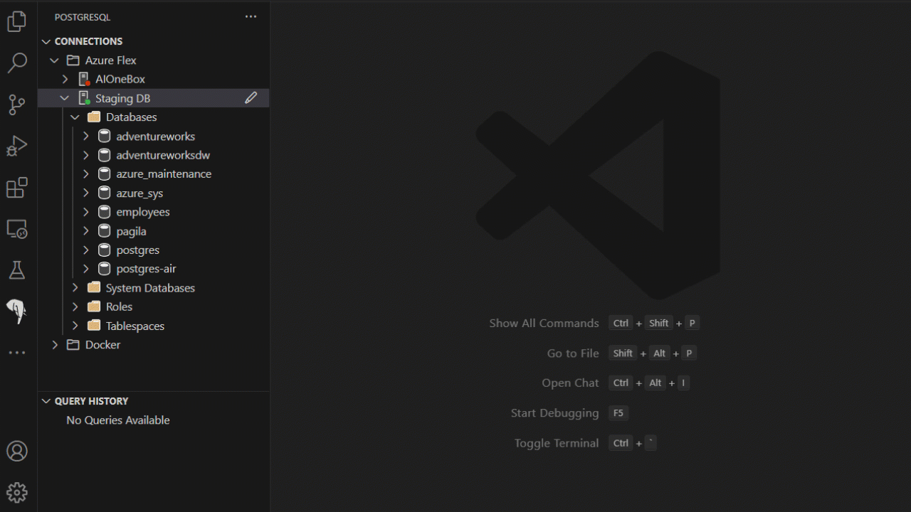

# PostgreSQL for Visual Studio Code (Preview)

PostgreSQL for Visual Studio Code is the essential extension for working with PostgreSQL databases - locally or in the cloud. Connect, query, build, and chat with your databases with ease, including seamless Entra authentication for Azure Database for PostgreSQL.

To learn more about the PostgreSQL extension and how it can simplify building
applications on PostgreSQL, visit our official [MSFT Learn Documentation].

## Features

Below are some of the key features of the PostgreSQL extension:

### Connect to PostgreSQL

Connect to any PostgreSQL database.

Browse Azure to easily find and connect to your Azure Database for PostgreSQL servers with either password or Entra authentication.

### Explore your database
Easily explore your database objects, including tables, views, functions, and more.

### Schema Visualization

Visualize your database schema quickly in VS Code.

### Copilot @pgsql agent

Chat with your database using the @pgsql agent in Copilot 'Ask' mode. Requires GitHub Copilot.

### Agent Mode Tools

Supercharge your workflow with GitHub Copilot Agent Mode tools, which allows the agents to run SQL queries, create tables, design schemas, import CSV files, and more.

### Create a docker PostgreSQL

Create a PostgreSQL database in a Docker container easily with a few clicks.

### Query

Run queries in a connected, intellisense-enabled VS Code editor. Results are displayed in a grid view, and you can easily export the results to CSV, JSON, or Excel.

### Run psql

Quickly connect psql to any of your databases, including Azure Database for PostgreSQL with Entra authentication.

## Usage

Get started with the PostgreSQL extension by installing it from the [Visual Studio Code Extension Market](https://marketplace.visualstudio.com/items?itemName=ms-ossdata.vscode-pgsql).

By default, Copilot integrations are disabled as they are still experimental features. To enable these, open your settings in `File -> Preferences -> Settings` or by hitting `ctrl + ,` then search for `pgsql copilot` and check the box for `Pgsql > Copilot : Enable`. This will prompt you to reload your window to apply the changes, after which you will be able to use the Copilot features.

## Feedback

For details on how to receive support for this extension, please see the
[SUPPORT.md](SUPPORT.md) document.

When reporting issues, it may be helpful to include debug logs. You can view
extension logs for the current session by:

1. Opening the Command Palette (Ctrl+Shift+P or Cmd+Shift+P on macOS).
2. Typing `PGSQL: Show Extension Logs` and selecting the option.
3. The logs will be displayed in the Output panel. You can copy and paste the logs from there.

The Tools Service also outputs logs to disk, which can be accessed by running
this command in the Command Palette:

- `PGSQL: Show Tools Service Logs`.

In rarer cases, the logs may be found in the VS Code logging directory, per
session. To open the session log folder, run this command in the Command
Palette:

- `Developer: Open Logs Folder`.

Look for log files whose name contains the terms:

- `Microsoft PostgreSQL Tools Service`
- `Microsoft PostgreSQL`

All of these logs could include host names, user names and other data that may be
sensitive. Please review their contents before sharing these logs with others, or
attaching them to an issue.

## Supported Operating Systems

The extension is supported on recent Windows, macOS, and Linux distributions. Experimental
support for ARM64 is available on Linux and macOS.

